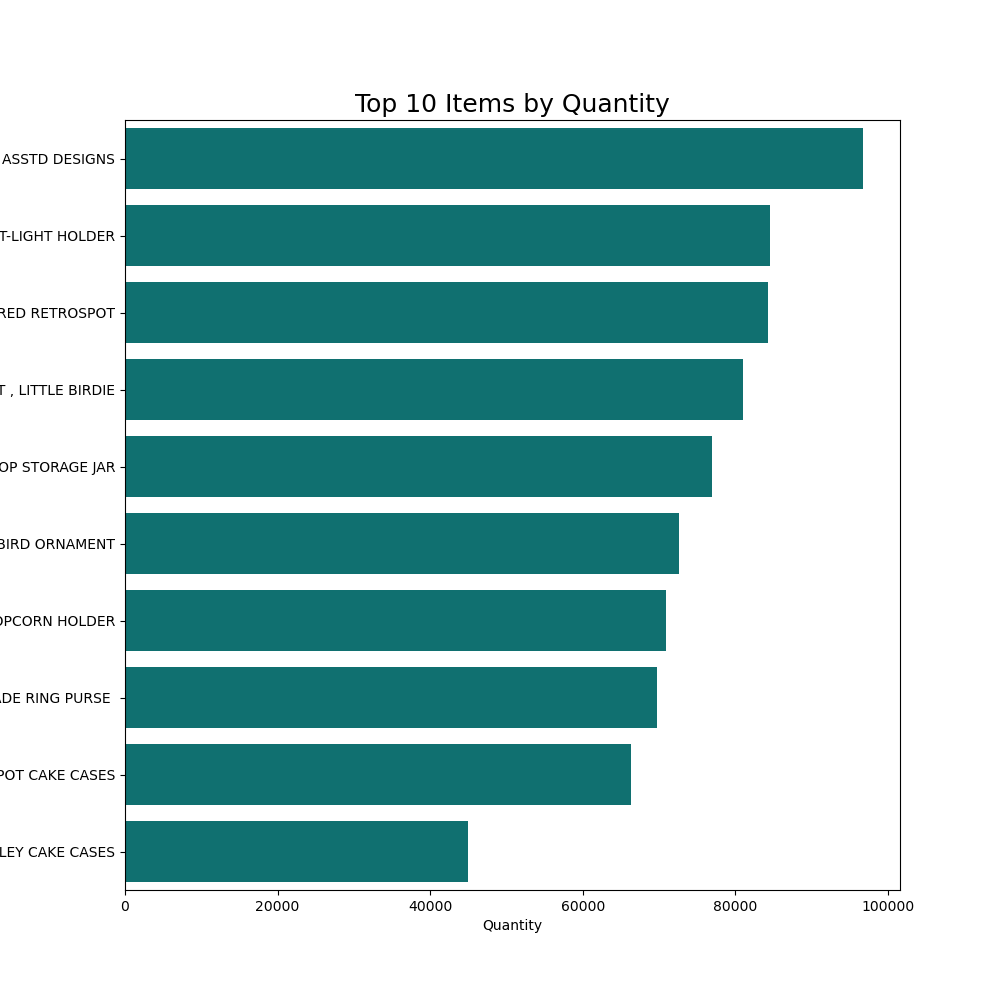
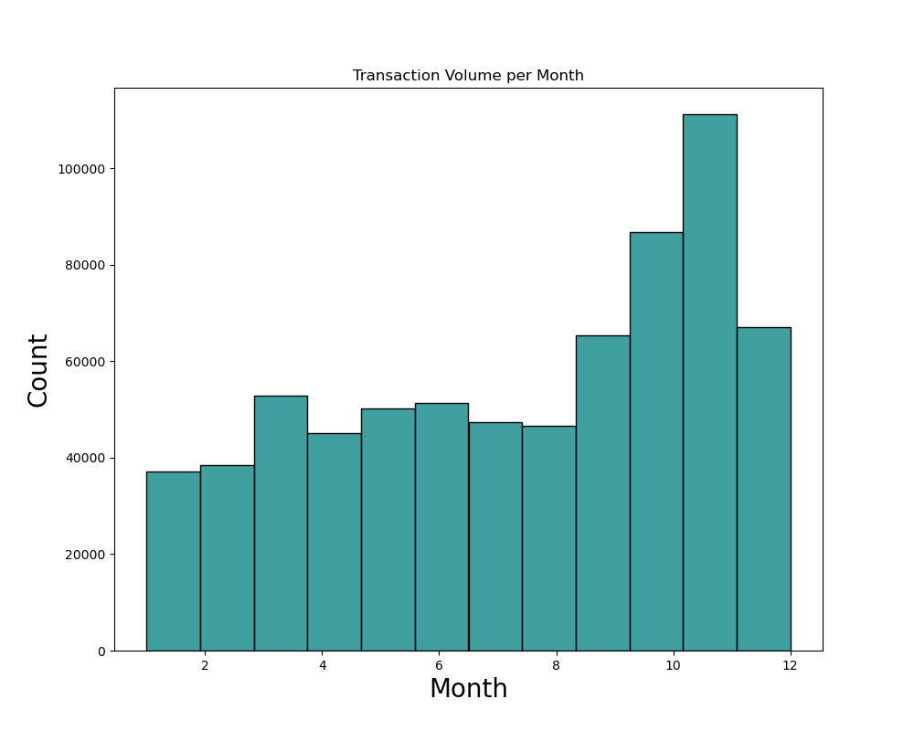
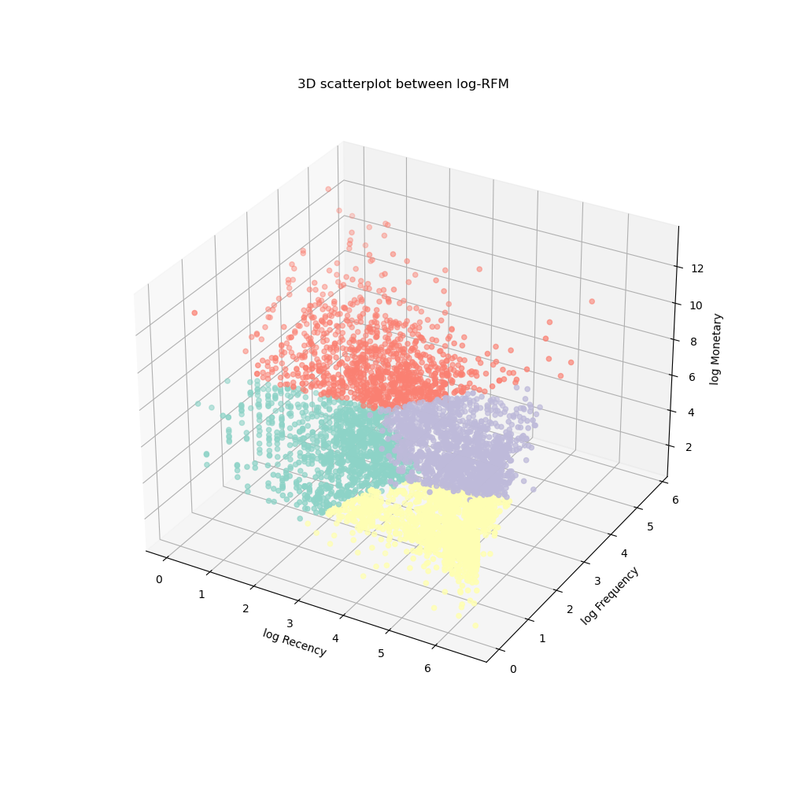
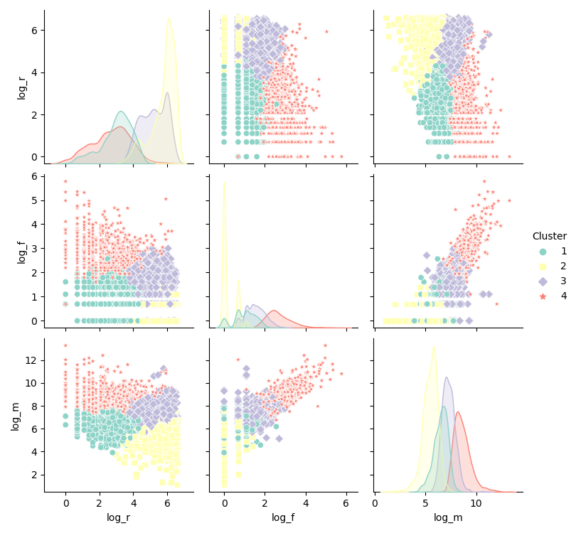
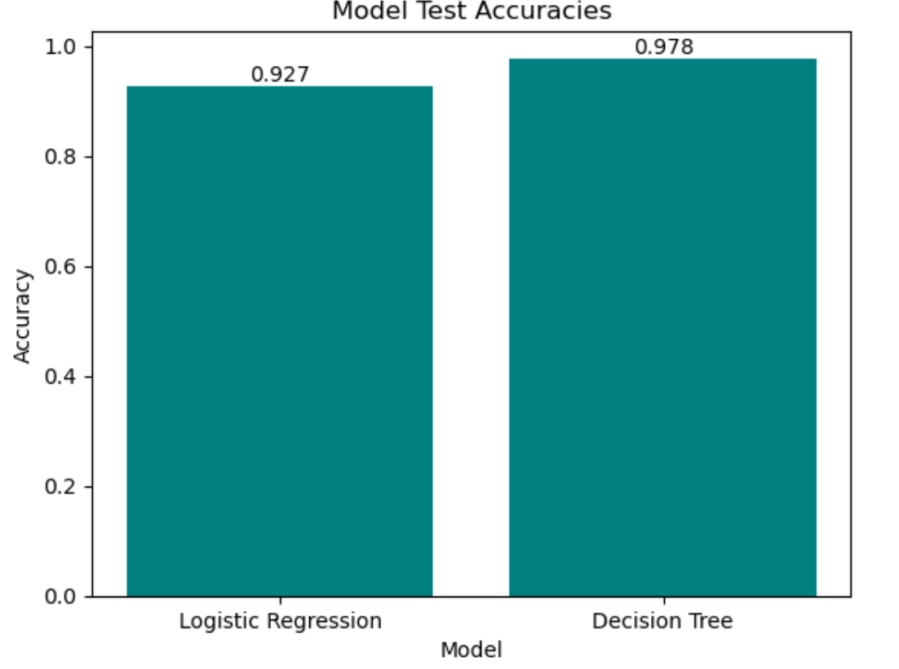

# Project: Introducing Data Science into Traditional Retail Organization

## Introduction

This project paints a scenario in a traditional retail company where the management committee is aiming to transit the company into a more data-driven organization by building an internal team to consistently conduct market research on their customers and products. As part of the newly created Data Science team, our first objective is to get managements' buy-in on the importance of building internal data science capabilities to main their support and commitment for further Data Science projects. We intend to achieve this by being more results-oriented in the initial phase of the project.

## Problem Statement
Despite positive customer reviews gathered by the marketing team, this has not led to an increase in customer growth, it could be attributed towards a shift in data adoption by other retail companies.

Below are the main deliverables that we aim to achieve with the marketing team (business users):
- To explore and enhance upon the customer segmentation beyond the current methodlogy of using RFM Analysis.
    - An unsupervised machine learning technique would be used to perform clustering using K-Means.

- To uncover insights and recommend suitable products to our customers.
    - Develop a recommender system based on collaborative filtering with insights from the customer clustering performed.

- Demand Forecasting: Use the sales data to forecast future demand.
    - Will be using Time Series Analysis to make a forecast from the sales data.

In a nutshell, a recommender system will be built to recommend the retail items that buyers often purchase together. This is a multi-label classification problem whereby the model performance will be guided by in house Hit-Rate as success metrics. The implementation of this recommender system would bring value to the marketing team and hence lend towards achieving our first objective of getting managements' buy-in on the importance of Data Science. Also, enabling the management committee to optimize inventory levels and plan coming fiscal accordingly with the help of Timeseries data.

## Contents

- [Data Collection](#Data-Collection)
- [Data Cleaning and EDA](#Data-Cleaning-and-EDA)
- [K-Means Clustering using RFM](#K-Means-Clustering-using-RFM)
- [Recommender System](#Recommender-System)
- [Supervied Models](#Supervised-Models)
- [Time Series, Seasonability Analysis](#Time-Series, Seasonability-Analysis)
- [Conclusion and Recommendations](#Conclusion-and-Recommendations)

## Data Collection

From the data [source](https://archive.ics.uci.edu/ml/datasets/Online+Retail+II)
- The dataset contains retail transaction data of 2 years (Dec-2009 to Dec-2011).
- The company mainly sells unique all-occasion gift-ware.
- Many customers of the company are wholesalers.
- Below are the fields of the dataset. 

| fields | description |
| --- | --- |
|Invoice| Invoice Number, 6-digit integral number uniquely assigned to each transaction. If this code starts with the letter 'c', it indicates a cancellation.|
|StockCode| Product (item) code, a 5-digit integral number uniquely assigned to each distinct product.|
|Description| Product (item) name|
|Quantity| The quantities of each product (item) per transaction was generated.|
|InvoiceDate|  Invoice Date and Time when the transaction was generated. |
|Price| Unit Price, product price per unit in Sterling (£).|
|Customer ID| Customer number, a 5-digit integral number uniquely assigned to each customer.|
|Country| Country name, the name of the country where the customer resides.|

## Data Cleaning and EDA

In the `Data Cleaning and EDA` of the project, the following tasks were performed:
- Identified and handled missing values and outliers
- Explored and described some distributions and summary statistics
- Created a unique item list that is 1 - 1
- Created RFM fields for RFM Analysis

### Top 10 Items by Transactions
These are the top 10 items by transaction count. 

    
### Transaction Volume by Month
Clearly, this is a retail dataset whereby we see higher sales volume in Q4 (festive season)

## K-Means Clustering using RFM
---
In the `K-Means Clustering by RFM` of the project, K Means Clustering was performed using the RFM values.

### Dendrogram
Dendrogram was used to have a general sense of how many clusters are there.

### 3-D Scatterplot 
Below is a 3D scatterplot of log_r, log_f, and log_m with 4 Clusters.

### 2-D Pairplot
Below is a 2D pairplot of log_r, log_f, and log_m with 4 Clusters. 

Cluster 1: 'New Customers'
Cluster 2: 'Lost Customers'
Cluster 3: 'Lost Customers with high spending'
Cluster 4: 'Important Customers'

### Accuracies - Supervised Models
A plot of the Decesion Tree and Logistic Regression model Test Accuracy scores taking users and the items being ordered by them into the account. 

## Recommender System

In the `Recommender System` of the project, both the User-Based and Item-Based Collborative Filtering were performed. 
- For the user-based collaborative filtering, segmentation were used to seggregate the customers into a more targeted way.

A recommender system is the "call-to-action", whereby we should be able to achieve some results in terms of sales volume. This would then be more impactful for all the users across the organization.

## Supervised Models

In the `Supervised Models` of the project, both the User-Based and Item-Based Filtering were performed. 

## Time Series, Seasonability Analysis

In the `Time Series` of the project, the main goal is to identify significant trends, seasonal patterns and residuals in products. Using advanced statistical analysis and visualization tools to analyze and interpret the temporal dynamics of the dataset

## Conclusion and Recommendation

Building an internal Data Science team should be simple as many of the machine learning techniques could be found online, working together as an organization is probably the most important factor for a successful implementation. In a data science project, a clear business objective has to be set right from the start. This allows the project to be more productive and results-oriented. The modeling can be enhanced along the way. The stakeholder support and commitment is very important, the project has to be realistic and reap tangible results in small steps. A diverse team of domain experts (such as the marketers) are important to help in the modeling process. 

For the start, this project should be able to let the marketing team understand more about the customers' behaviour as a cluster, this should help them in formulating a more informed marketing strategy to reach out to the various groups of customers. 

For an added layer, also did a seasonality analysis which should give an idea to the management the products to focus in to in a given month of the year as well as week. 

Also, built a Logistic Regression and Decision Tree model with more than 97% test accuracy which could help the stakeholders getting a vision on which specific products, customers in selected countries to focus in the upcoming festive season. 

More data could be gathered to form a better clustering technique, such as the customers' demographic. More data is also needed to help to improve the recommender system. A/B testing should be performed to further evaluate the recommender system. 

